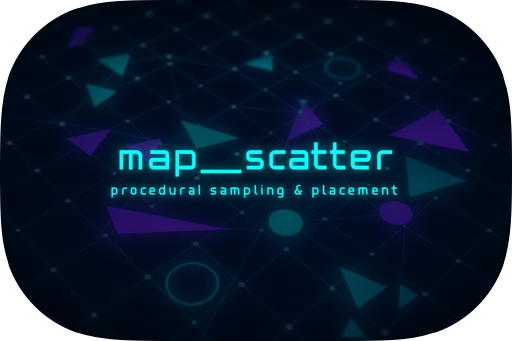

# bevy_map_scatter

[](https://github.com/morgenthum/map_scatter#license)
[](https://docs.rs/bevy_map_scatter)
[](https://crates.io/crates/bevy_map_scatter)
[](https://github.com/morgenthum/map_scatter/actions/workflows/ci.yml)

Bevy plugin for rule-based object scattering: data-driven rules, multiple sampling strategies, and reproducible results - integrated with Assets and ECS.



## Features

Provides data-driven object scattering for Bevy: populate worlds with many small entities using multiple sampling strategies - as assets, async, and ECS-friendly:
- Asset-based authoring of scatter plans (RON): load `*.scatter` files via `AssetServer`.
- Texture integration: snapshot Bevy `Image`s to CPU textures with configurable domain mapping.
- Asynchronous execution: runs scatter jobs on `AsyncComputeTaskPool`.
- ECS-friendly: placements become entities; components can be attached for rendering, gameplay, or tooling.
- Streaming helper: manage chunked scatter around moving anchors (optional plugin).
- Diagnostics: forward core events as Bevy messages (`ScatterMessage`, `ScatterFinished`).

## Use cases

Populate a Bevy world with many small entities (plants, props, resources, decals) in a data‑driven, repeatable, and editor‑friendly workflow.

Provides:
- Asset‑based plans can be hot‑reloaded
- Fast iteration by tweaking textures/thresholds/layer order
- Deterministic seeds (or per‑run variation) and async execution

Examples:
1. Stylized forest: trees (sparse) => mushrooms where tree probability is low => grass fills gaps
2. Town dressing: benches in plaza masks => lamp posts along roads with spacing => clutter only where nothing else landed
3. Dungeon encounters: camps in large rooms => enemies avoid camp influence => rare loot in dead‑ends with minimum spacing

Bevy integration highlights:
- Assets: versioned, hot‑reloadable scatter plans
- ECS: placements become entities that can be tagged/decorated
- Async: compute on `AsyncComputeTaskPool`; main schedule stays responsive
- Determinism: same seed + plan + textures = identical placements
- Extensibility: react to events (`ScatterFinished`, messages) to spawn or run custom logic

## Examples

See the [example crate](https://github.com/morgenthum/map_scatter/blob/main/crates/bevy_map_scatter_examples/README.md) for curated demos you can run locally.

## Quick start

Add the crates to a Bevy application:

```toml
# Cargo.toml
[dependencies]
bevy = "0.18"
bevy_map_scatter = "0.2"
map_scatter = "0.2"
```

Create a scatter plan in `assets/simple.scatter`:

```ron
(
  layers: [
    (
      id: "dots",
      kinds: [
        (
          id: "dots",
          spec: (
            nodes: {
              "probability": Constant(
                params: ConstantParams(value: 1.0),
              ),
            },
            semantics: {
              "probability": Probability,
            },
          ),
        ),
      ],
      sampling: JitterGrid(
        jitter: 1.0,
        cell_size: 1.0,
      ),
      selection_strategy: WeightedRandom,
    ),
  ],
)
```

Trigger a single scatter run once the asset is ready:

```rust
use bevy::prelude::*;
use bevy_map_scatter::prelude::*;

#[derive(Resource, Default)]
struct PlanHandle(Handle<ScatterPlanAsset>);

fn main() {
    App::new()
        .init_resource::<PlanHandle>()
        .add_plugins(DefaultPlugins)
        .add_plugins(MapScatterPlugin)
        .add_systems(Startup, load_plan)
        .add_systems(Update, trigger_request)
        .add_observer(log_finished)
        .run();
}

/// Loads the scatter plan asset on startup.
fn load_plan(mut handle: ResMut<PlanHandle>, assets: Res<AssetServer>) {
    handle.0 = assets.load("simple.scatter");
}

/// Triggers a scatter request once the plan asset is loaded.
fn trigger_request(
    mut commands: Commands,
    mut once: Local<bool>,
    handle: Res<PlanHandle>,
    assets: Res<Assets<ScatterPlanAsset>>,
) {
    // Only run once.
    if *once {
        return;
    }
    // Wait until the asset is loaded.
    if assets.get(&handle.0).is_none() {
        return;
    }

    // The domain size for scattering.
    let domain = Vec2::new(10.0, 10.0);

    // Create run configuration and seed for (deterministic) randomness.
    let config = RunConfig::new(domain)
        .with_chunk_extent(domain.x)
        .with_raster_cell_size(1.0);

    // Spawn an entity to track the request.
    // In real applications you might want to add your own components here,
    // or use an existing entity.
    let entity = commands.spawn_empty().id();

    // Trigger the scatter run.
    commands.trigger(ScatterRequest::new(entity, handle.0.clone(), config, 42));

    // Mark as done.
    *once = true;
}

/// Observes the `EntityEvent` when a scatter run has finished.
fn log_finished(finished: On<ScatterFinished>, mut commands: Commands) {
    info!(
        "Scatter run {} finished: placements={} evaluated={} rejected={}",
        finished.entity,
        finished.result.placements.len(),
        finished.result.positions_evaluated,
        finished.result.positions_rejected
    );

    // Clean up the entity used for the request.
    // In real applications you might want to keep it,
    // depending on your use case.
    commands.entity(finished.entity).despawn();
}
```

Run the application with `cargo run`. After the scatter job completes, a summary appears in the log; continue with placement logic as needed.

## Streaming (optional)

For moving worlds or endless maps, use `MapScatterStreamingPlugin` and attach
`ScatterStreamSettings` to an anchor entity. The plugin will spawn/despawn chunks
around the anchor and emit placement entities tagged with `ScatterStreamPlacement`.

## Alternatives

- [`bevy_feronia`](https://github.com/NicoZweifel/bevy_feronia): more opinionated, art-focused scattering with built-in wind/material/LOD workflows; likely a better fit if you want an end-to-end visual pipeline rather than a low-level, data-driven scatter core.

## Compatibility

| `bevy_map_scatter` | `map_scatter` | `bevy` |
| ------------------ | ------------- | ------ |
| `0.3`              | `0.2`         | `0.18` |
| `0.2`              | `0.2`         | `0.17` |
