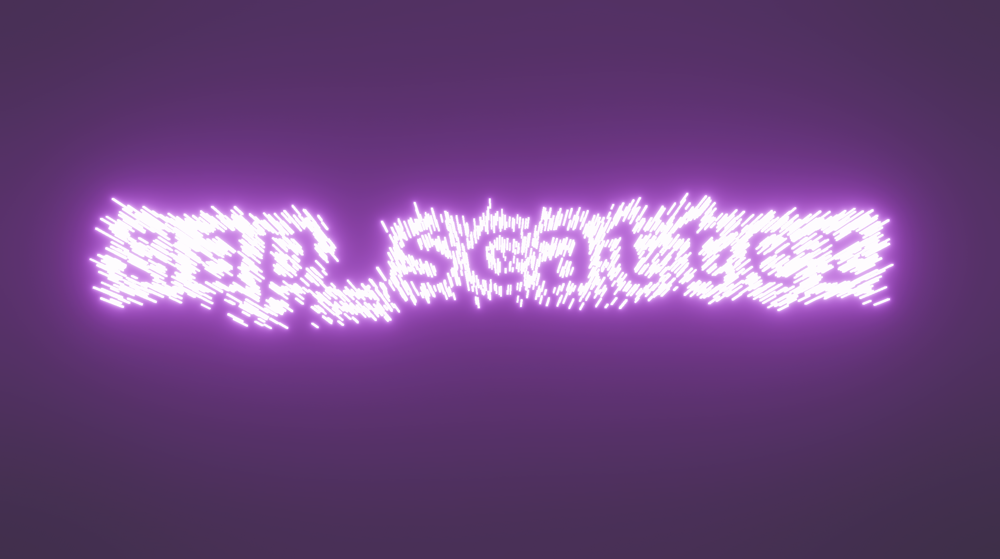

# bevy_map_scatter_examples

Run any example with `cargo run -p bevy_map_scatter_examples --bin <name>` (add `--release` for faster renders).

## Streaming

### Spaceflight Streaming
Source: [src/bin/streaming-spaceflight.rs](src/bin/streaming-spaceflight.rs)

Stream chunks around a moving ship and spawn/despawn 3D stars, asteroids, debris, and comets as you fly forward.

### Minimal Streaming
Source: [src/bin/streaming-minimal.rs](src/bin/streaming-minimal.rs)

Stream chunks around a drifting anchor and attach simple emissive cubes to placements.

## 3D

### 3D Text Effect
Source: [src/bin/3d-text-effect.rs](src/bin/3d-text-effect.rs)

Shows a 2D mask-driven scatter rendered as animated 3D cubes.

