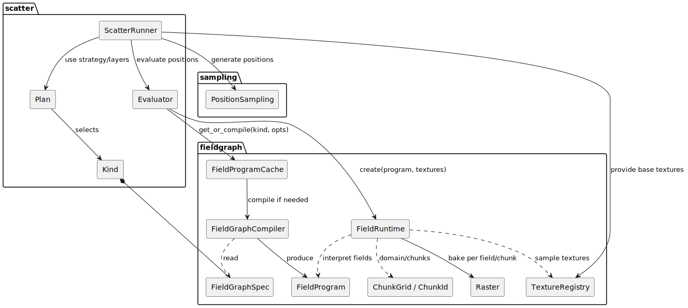
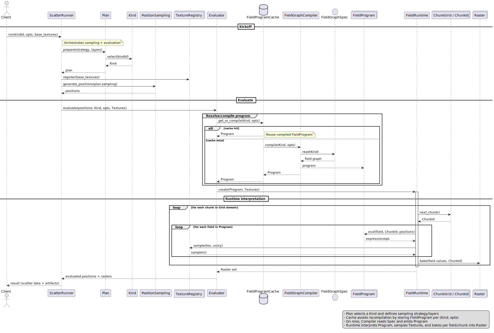

# Architecture

- Purpose: Efficiently sample positions and evaluate them against a field-graph-based program to produce scatter data and auxiliary raster artifacts.
- Design pillars: separation of orchestration vs. evaluation, explicit compilation step with caching, streaming/chunked runtime, and texture-backed field sampling.

## High-level Components

At a glance, the system is organized into three functional areas:

- sampling
  - `PositionSampling` — produces candidate positions based on a configured sampling strategy.
- scatter
  - `ScatterRunner` — end-to-end orchestration entrypoint.
  - `Plan` — bundle of strategy and layer configuration; selects a `Kind`.
  - `Kind` — identifies the field-graph specification to be used for a scenario.
  - `Evaluator` — resolves/compiles the program and evaluates positions.
- fieldgraph
  - `FieldGraphSpec` — declarative description of fields and their relationships.
  - `FieldGraphCompiler` — turns a `Spec` into an executable `FieldProgram`.
  - `FieldProgram` — compiled representation consumed by the runtime.
  - `FieldRuntime` — interprets a `Program` over a spatial domain.
  - `TextureRegistry` — provides texture lookups to the runtime.
  - `ChunkGrid / ChunkId` — partitions the domain for streaming evaluation.
  - `Raster` — per-field, per-chunk baked results.
  - `FieldProgramCache` — caches compiled programs keyed by (`Kind`, options).

### Component Diagram

## End-to-End Flow

1. Kickoff
   - A client asks `ScatterRunner` to run with a `KindId`, options, and base textures.
   - `ScatterRunner` builds a `Plan` (strategy + layers), selects the `Kind`, registers textures, and generates positions via `PositionSampling`.

2. Evaluate
   - `ScatterRunner` asks `Evaluator` to evaluate the positions using the chosen `Kind` and options.
   - The `Evaluator` fetches or compiles a `FieldProgram` using `FieldProgramCache`.
     - Cache hit: reuse the existing `Program`.
     - Cache miss: `Compiler` reads the `Spec` for the `Kind` and emits a `Program`, which is stored in the cache.

3. Runtime Interpretation
   - `Evaluator` creates a `FieldRuntime` with the `Program` and `Textures`.
   - The runtime iterates the domain chunk-by-chunk (`ChunkGrid`), evaluates each field in the `Program`, samples textures as needed, and bakes resulting values into `Raster` outputs.

4. Results
   - The evaluated positions and associated raster artifacts are returned to the client.

### Sequence Diagram

## Key Responsibilities

- ScatterRunner
  - Orchestrates plan preparation, texture registration, position sampling, and evaluation calls.
- Plan
  - Encapsulates the sampling configuration and layer strategy; selects a `Kind`.
- Kind
  - Identifies which `FieldGraphSpec` to use.
- PositionSampling
  - Generates candidate positions from the plan’s sampling configuration.
- Evaluator
  - Bridges from positions and `Kind` to runnable `FieldProgram`, managing cache/compile and runtime evaluation.
- FieldProgramCache
  - Avoids redundant compilation by caching programs keyed by (`Kind`, options).
- FieldGraphCompiler
  - Reads the `FieldGraphSpec` for a `Kind` and emits a `FieldProgram`.
- FieldRuntime
  - Interprets the `FieldProgram` over the chunked domain, samples `Textures`, and produces `Raster` data.
- TextureRegistry
  - Provides texture access (e.g., by name/handle) for the runtime.
- ChunkGrid / ChunkId
  - Defines the spatial tiling of evaluation, enabling streaming and memory-friendly processing.
- Raster
  - Holds per-field, per-chunk baked values, useful as artifacts or inputs to downstream steps.

## Data Model: Inputs and Outputs

- Inputs
  - `kindId` and evaluation options
  - Base textures registered in `TextureRegistry`
  - Plan-derived sampling parameters
- Outputs
  - Scatter results (positions with evaluated attributes)
  - Raster artifacts per field/chunk

## Performance Considerations

- Compilation caching
  - `FieldProgramCache` eliminates repeated compile work for the same (`Kind`, options) pair.
- Chunked evaluation
  - `ChunkGrid` limits working set size and supports streaming execution across large domains.
- Texture-backed fields
  - Texture access is centralized through `TextureRegistry` for efficient reuse and sampling.

## Extensibility

- New Kind or Spec
  - Add/extend a `FieldGraphSpec`. The `Compiler` will generate a `FieldProgram` that the runtime can interpret.
- New sampling strategies
  - Extend `PositionSampling` and reference it from `Plan`.
- New fields or operations
  - Enhance the `Spec` and ensure the `Compiler` and `Runtime` support the corresponding operations.
