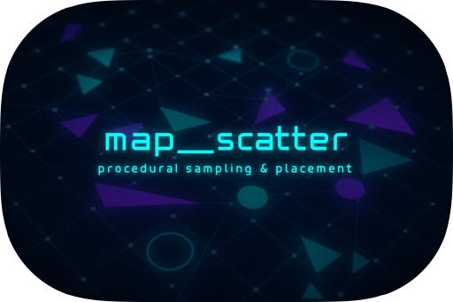

# map_scatter

[](https://github.com/morgenthum/map_scatter#license)
[](https://docs.rs/map_scatter)
[](https://crates.io/crates/map_scatter)
[](https://github.com/morgenthum/map_scatter/actions/workflows/ci.yml)

Rule-based object scattering library with field-graph evaluation and sampling.



## What is it?

**map_scatter** helps you fill 2D worlds (or a 2D projection of 3D) with lots of small things - vegetation, props, resources, decals, spawn points - quickly and reproducibly.

## How it works (short)

You describe it in three simple parts:
- Fields (where things may appear): numbers per position built from textures, distances, and simple operations like thresholds or masks.
- Sampling (how candidates are spread): Poisson disk/blue‑noise, jittered grid, low‑discrepancy (Halton), best‑candidate, clustered, etc.
- Layers (in what order categories are placed): later layers can avoid or reuse earlier results via overlays/masks.

Fields are compiled into a program and evaluated in chunks with caching for deterministic performance.

Links:
- Examples: https://github.com/morgenthum/map_scatter/blob/main/crates/map_scatter_examples/README.md
- Architecture: ./ARCHITECTURE.md


### Highlights

- Field graph authoring and compilation into an efficient program
- Chunked evaluation with raster caching for speed
- Multiple sampling strategies for candidate generation
- Per-layer selection strategies (weighted random, highest probability)
- Optional overlay generation to feed subsequent layers
- Event stream for inspection, logging, and tooling

## Use cases

map_scatter is for situations where you need to fill a 2D world (or a 2D projection of a 3D one) with many small things - plants, props, resources, decals - while keeping control over:
- Where they can appear (rules, masks, gradients)
- How dense or sparse each category is
- How later layers react to earlier ones (avoid, blend, fill gaps)
- Performance and determinism (repeatable seeds, chunked evaluation)

Three examples:

1. Open‑world survival (vegetation & resources)  
   You want tall trees only on gentle ground, berry bushes in semi‑open spaces not too close to trees, and scattered herbs in any remaining gaps but never inside player paths. A single layered plan: trees first (sparse sampler), bushes next (jittered grid but excluding tree placements), herbs last (fill remaining probability). Change a moisture texture or tweak a threshold and regenerate instantly with the same seed for reproducible builds.

2. City builder / settlement dressing  
   You generate lamp posts along roads, then place decorative planters only where there is light coverage but not blocking intersections, and finally small clutter (crates, barrels) where neither lamp posts nor planters ended up. Each layer can produce an overlay mask the next one uses to stay out of the way - without manual adjustments after layout changes.

3. Roguelike / dungeon population  
   First pass: safe camp markers in wide rooms (uniform sampler filtered by room size). Second: enemy spawn points in other rooms but never within a radius of a camp overlay. Third: rare loot stashes in dead-end corridors with a low probability but guaranteed minimum spacing. Reroll with a different seed for variety while keeping consistent logic.

Notes:
- Express intention: "only near", "not inside", "prefer lighter areas" instead of hard-coded placement loops.
- Iterate quickly: tweak thresholds, textures, or ordering and rerun.
- Mix distribution styles without bespoke code per asset type.
- Keep large worlds manageable: chunked evaluation avoids blowing up memory or frame time.
- Deterministic builds: same seed + same inputs = identical placements.

## Examples

See the [example crate](https://github.com/morgenthum/map_scatter/blob/main/crates/map_scatter_examples/README.md) for curated demos you can run locally.


## Architecture

For a high-level architecture overview, see [ARCHITECTURE.md](./ARCHITECTURE.md).

## Status

This crate is actively developed. The core APIs are designed to be practical and composable for real projects. Feedback and contributions are welcome.

## Quick Start

Add the dependency:

```toml
[dependencies]
map_scatter = "0.2"
rand = "0.9"
glam = { version = "0.30", features = ["mint"] }
mint = "0.5"
```

Hello, scatter:

```rust
use glam::Vec2;
use rand::{SeedableRng, rngs::StdRng};

use map_scatter::prelude::*;

fn main() {
    // 1) Author a field graph for a "kind"
    //    Here, we tag a constant=1.0 as the Probability field (always placeable).
    let mut spec = FieldGraphSpec::default();
    spec.add_with_semantics(
        "probability",
        NodeSpec::constant(1.0),
        FieldSemantics::Probability,
    );
    let grass = Kind::new("grass", spec);

    // 2) Build a layer using a sampling strategy (e.g., jittered grid)
    let layer = Layer::new_with(
        "grass",
        vec![grass],
        JitterGridSampling::new(0.35, 5.0), // jitter, cell_size
    )
    // Optional: produce an overlay mask to reuse in later layers (name: "mask_grass")
    .with_overlay((256, 256), 3);

    // 3) Assemble a plan (one or more layers)
    let plan = Plan::new().with_layer(layer);

    // 4) Prepare runtime
    let mut cache = FieldProgramCache::new();
    let textures = TextureRegistry::new(); // Register textures as needed
    let cfg = RunConfig::new(Vec2::new(100.0, 100.0))
        .with_chunk_extent(32.0)
        .with_raster_cell_size(1.0)
        .with_grid_halo(2);

    // 5) Run
    let mut rng = StdRng::seed_from_u64(42);
    let mut runner = ScatterRunner::new(cfg, &textures, &mut cache);
    let result = runner.run(&plan, &mut rng);

    println!(
        "Placed {} instances (evaluated: {}, rejected: {}).",
        result.placements.len(),
        result.positions_evaluated,
        result.positions_rejected
    );
}
```

Observing events:

```rust
use rand::{SeedableRng, rngs::StdRng};
use map_scatter::prelude::*;

fn run_with_events(plan: &Plan) {
    let mut cache = FieldProgramCache::new();
    let textures = TextureRegistry::new();
    let cfg = RunConfig::new(glam::Vec2::new(64.0, 64.0));
    let mut rng = StdRng::seed_from_u64(7);

    let mut runner = ScatterRunner::new(cfg, &textures, &mut cache);

    // Capture events for inspection (warnings, per-position evaluations, overlays, etc.)
    let mut sink = VecSink::new();
    let result = runner.run_with_events(plan, &mut rng, &mut sink);

    for event in sink.into_inner() {
        match event {
            ScatterEvent::PlacementMade { placement, .. } => {
                println!("Placed '{}' at {:?}", placement.kind_id, placement.position);
            }
            ScatterEvent::Warning { context, message } => {
                eprintln!("[WARN] {context}: {message}");
            }
            _ => {}
        }
    }

    println!("Total placed: {}", result.placements.len());
}
```

## Performance Notes

- Chunked evaluation: Keeps working sets small and cache-friendly.
- Raster cell size and chunk extent control performance/quality trade-offs.
- Field programs are cached and reused per (Kind, Chunk).
- Overlays are generated only when configured on the layer.

## API Tips

- Bring common types into scope with:
  ```rust
  use map_scatter::prelude::*;
  ```
- Start simple: one kind with a constant Probability field, then introduce gates/overlays.
- Tune `RunConfig`:
  - `domain_center`: shift the evaluated window in world space (useful for streaming chunks)
  - `chunk_extent`: larger chunks reduce overhead but can increase evaluation cost
  - `raster_cell_size`: smaller cells improve accuracy at higher cost
  - `grid_halo`: extra cells for filters/EDT at chunk borders
- Overlays: bridge layers by enabling `with_overlay`, then refer to the registered texture `mask_<layer_id>` in subsequent field graphs.

## Compatibility

- 2D domains (Vec2 positions); usable for 3D by feeding height/slope textures and augmenting the 2D placement with a height component in your engine
- No engine lock-in; pair with your renderer/tooling of choice
- Integrates well with `tracing` for diagnostics
- Use `rand` RNGs; examples commonly use `StdRng`

## Benchmarks

Some micro-benchmarks are included:
```bash
cargo bench -p map_scatter
```
