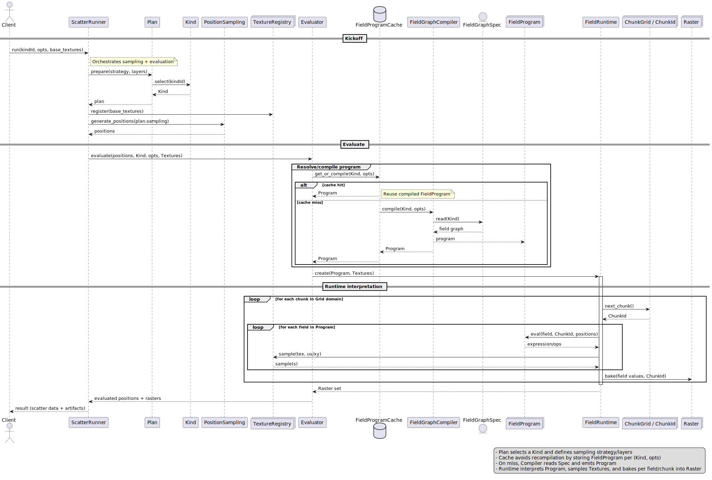

# Architecture

map_scatter separates candidate generation from evaluation, then executes compiled field graphs in chunks for deterministic, scalable performance.

## Core components

- **Sampling**
  - `PositionSampling` generates candidate positions for each layer.
- **Planning**
  - `Kind` defines field logic for one category.
  - `Layer` combines kinds with a sampling strategy.
  - `Plan` orders layers and drives execution.
- **Evaluation**
  - `ScatterRunner` orchestrates the run.
  - `Evaluator` executes gate and probability fields per kind.
- **Field graph**
  - `FieldGraphSpec` describes nodes and semantics.
  - `FieldProgram` is the compiled representation.
  - `FieldRuntime` samples the program over a spatial domain.
  - `FieldProgramCache` keeps compiled programs reusable across runs.
- **Textures and overlays**
  - `TextureRegistry` provides external data sources.
  - Overlay masks are generated per layer as `mask_<layer_id>` textures.

## End-to-end flow

1. **Plan setup**: build a `Plan` from one or more layers.
2. **Candidate generation**: each layer's sampler produces positions.
3. **Compile or fetch**: field graphs compile into programs, cached by kind.
4. **Evaluate**: gate fields allow or reject, probability fields weight selection.
5. **Select and place**: a selection strategy picks a kind per position.
6. **Overlays (optional)**: a mask is rasterized from placements.
7. **Results**: placements, overlays, and counts are returned.

## Chunked evaluation and caching

The domain is divided into chunks, allowing field graphs to be evaluated in manageable blocks. Raster cells are sampled at a fixed resolution, and a small halo avoids artifacts at chunk borders. This approach keeps memory usage predictable and enables streaming workflows.

## Determinism

A run is deterministic when the plan, inputs, and seed are the same. Changing textures, order, or configuration changes the output, while repeated runs with identical inputs are stable.

## Observability

`ScatterEvent` streams allow you to inspect warnings, per-position evaluations, and overlay creation. This is useful for tooling and debugging.
